# Как пользоваться Subtitler

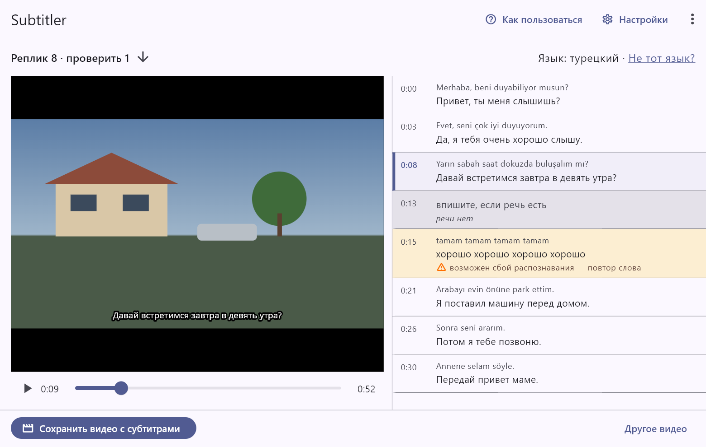

Subtitler делает из видео с иностранной речью то же видео с русскими
субтитрами. Речь распознаёт и переводит Яндекс Облако, поэтому программе
нужны интернет и ваш ключ Яндекс Облака. Листайте шаги стрелками по бокам
или клавишами ← →.

> Звук из видео и распознанный текст уходят на серверы Яндекс Облака.
> Если в видео есть личные или конфиденциальные данные, решите сами,
> можно ли передавать их стороннему сервису. Руководство открывается само
> при первом запуске, а потом — кнопкой «Как пользоваться» рядом
> с «Настройками».

## Ключ Яндекс Облака

### Откройте Yandex AI Studio

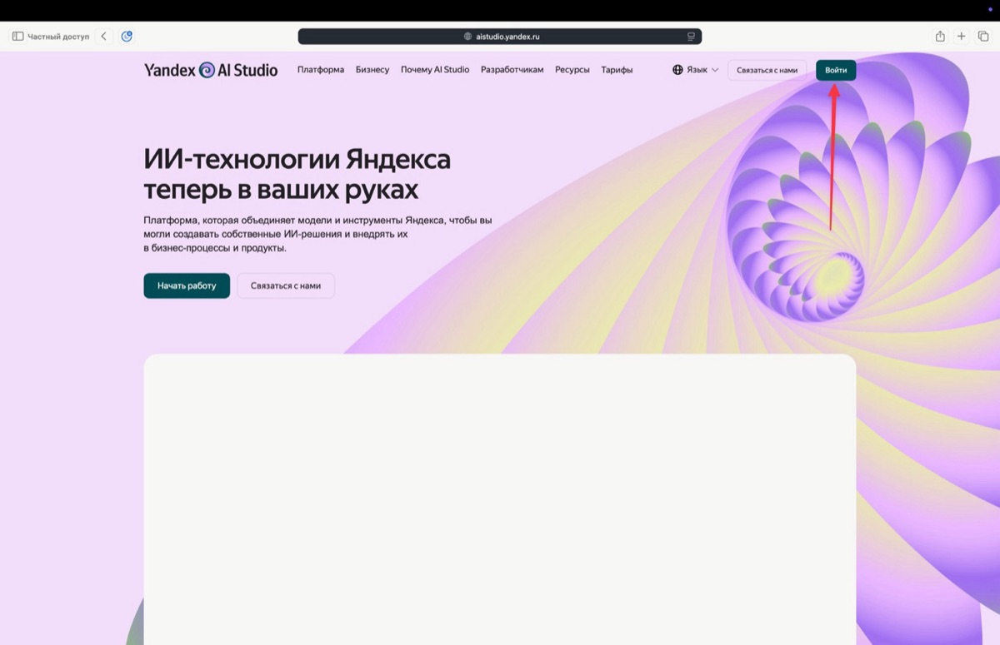

Откройте [aistudio.yandex.ru](https://aistudio.yandex.ru) и нажмите
«Войти». Ключ создаётся один раз: программа сохранит его на этом
компьютере.

### Войдите с аккаунтом Яндекса

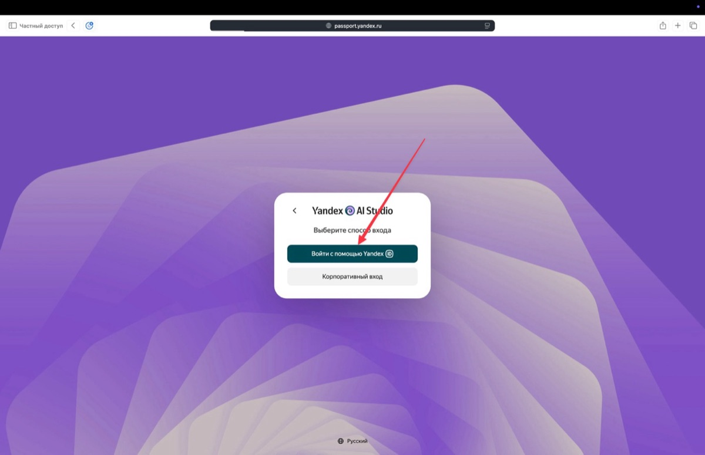

Выберите «Войти с помощью Yandex ID» и войдите в свой аккаунт Яндекса.

### Выберите проект

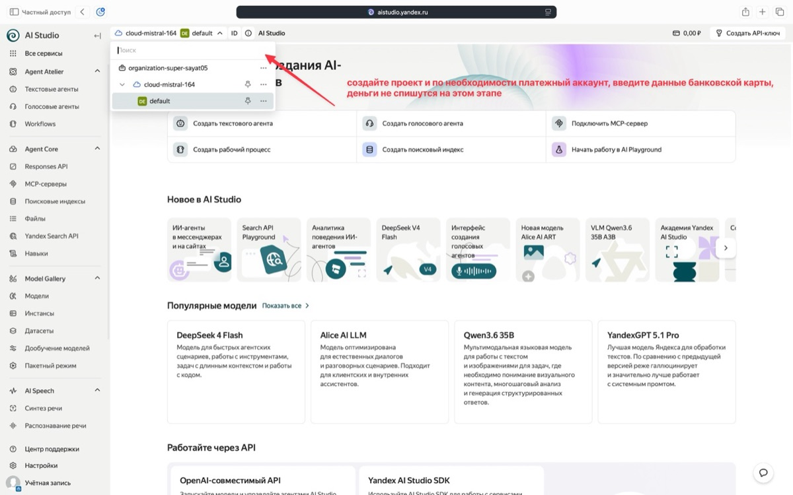

Выберите проект слева вверху — при первом входе создайте его — и при
необходимости платёжный аккаунт.

> Для платёжного аккаунта нужны данные банковской карты, но на этом шаге
> деньги не списываются.

### Создайте API-ключ

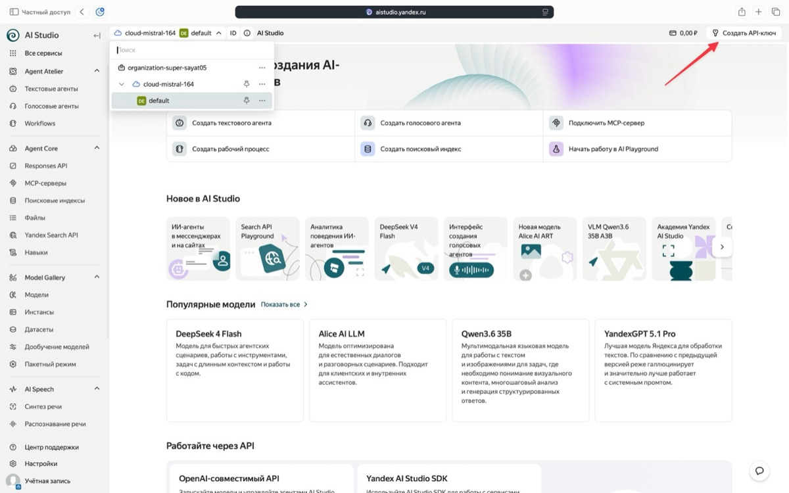

Нажмите «Создать API-ключ» справа вверху.

### Укажите описание и срок

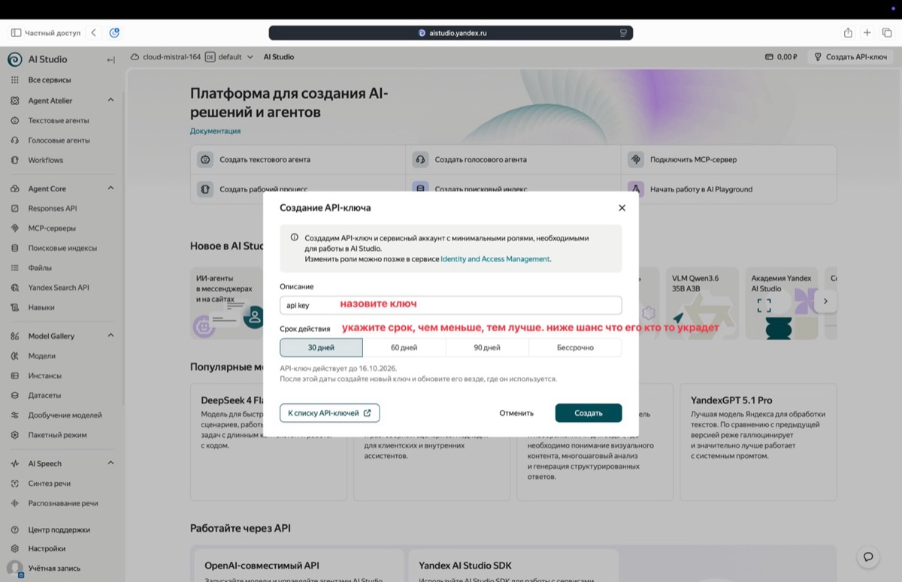

Впишите описание ключа и выберите срок действия, затем нажмите «Создать».
Чем короче срок, тем меньше вреда, если ключ украдут.

### Скопируйте ключ

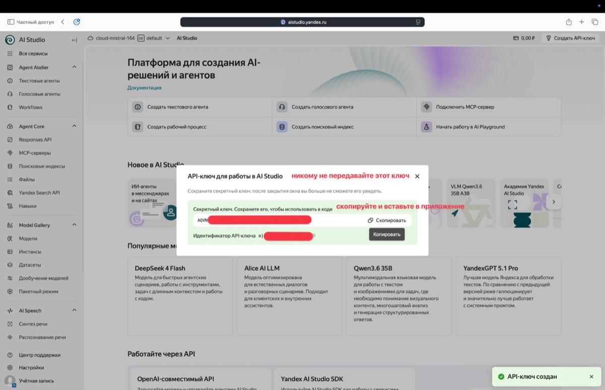

Нажмите «Скопировать» у секретного ключа — он начинается с AQVN. После
закрытия окна ключ больше не покажут. **Никому не передавайте ключ.**

> Когда срок ключа закончится, создайте новый так же и замените его в
> программе: «Настройки» → «Заменить ключ».

## Первый запуск

### Запустите программу

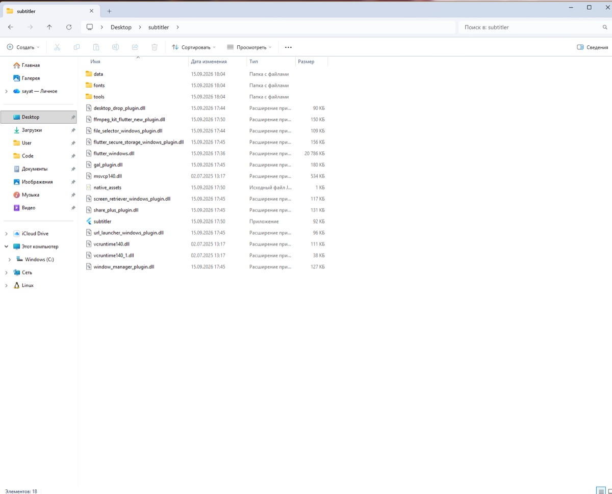

Распакуйте архив subtitler-windows-x64.zip **целиком** в любую папку,
например на рабочий стол, и запустите subtitler.exe. Устанавливать ничего
не нужно, права администратора не нужны.

> Если появится окно «Система Windows защитила ваш компьютер», нажмите
> «Подробнее», затем «Выполнить в любом случае»: программа не подписана
> сертификатом, поэтому Windows о ней предупреждает.

### Вставьте ключ

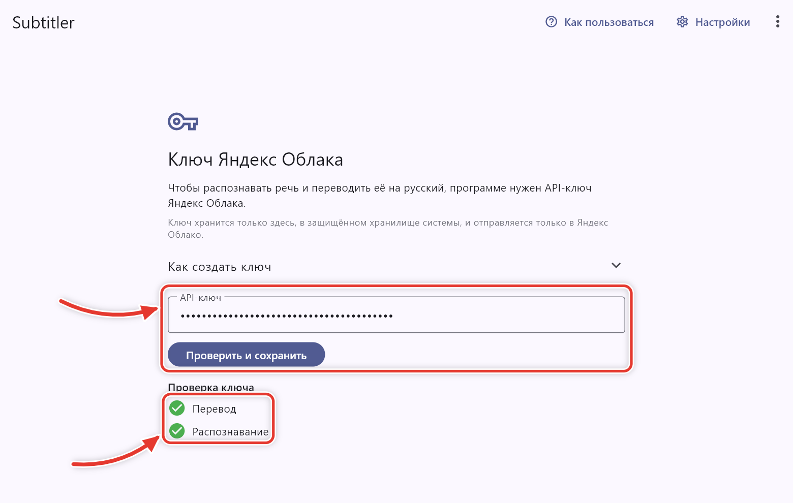

Вставьте скопированный ключ в поле «API-ключ» и нажмите «Проверить и
сохранить». Должны загореться две зелёные галочки — «Перевод» и
«Распознавание».

> Если какая-то галочка не загорелась, под ней написано, что не так.

## Субтитры для видео

### Откройте видео

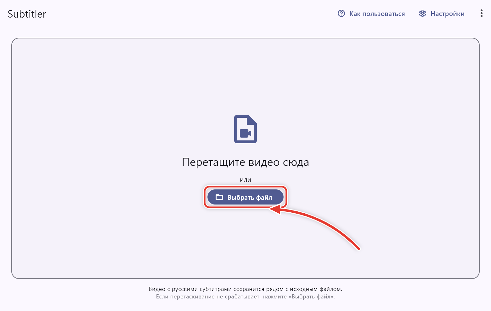

Перетащите видео в окно программы или на значок subtitler.exe — или
нажмите «Выбрать файл». Обработка начнётся сама: язык речи программа
определит без вопросов.

### Дождитесь обработки

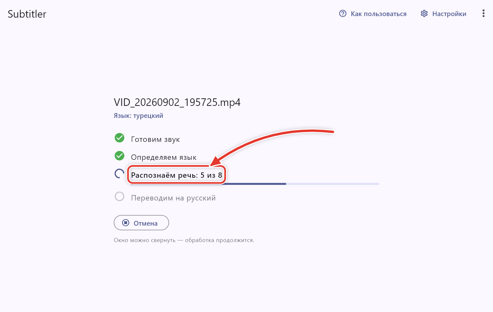

Время зависит от длины ролика, скорости интернета и компьютера; на диске
нужно свободное место примерно размером с видео. Окно можно свернуть.
«Отмена» останавливает обработку, а уже распознанное сохраняется: если
открыть видео снова, обработка продолжится с того же места.

> Когда закончится пробный период Яндекс Облака, распознавание станет
> платным — примерно 30 тенге за минуту видео.

### Проверьте перевод

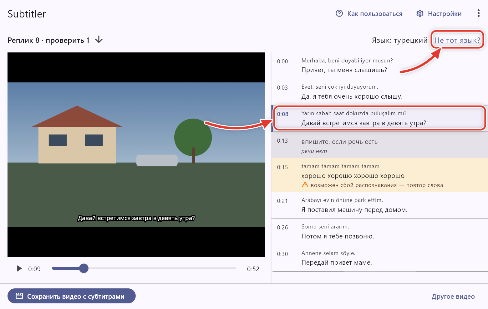

Щелчок по реплике перематывает видео к ней, а перевод можно исправить
прямо в списке — в кадре правка видна сразу. Жёлтые строки стоит
проверить: под ними написано почему.

> Если перевод выглядит бессмысленным, скорее всего язык определён
> неверно — нажмите «Не тот язык?» и выберите другой.

### Сохраните видео

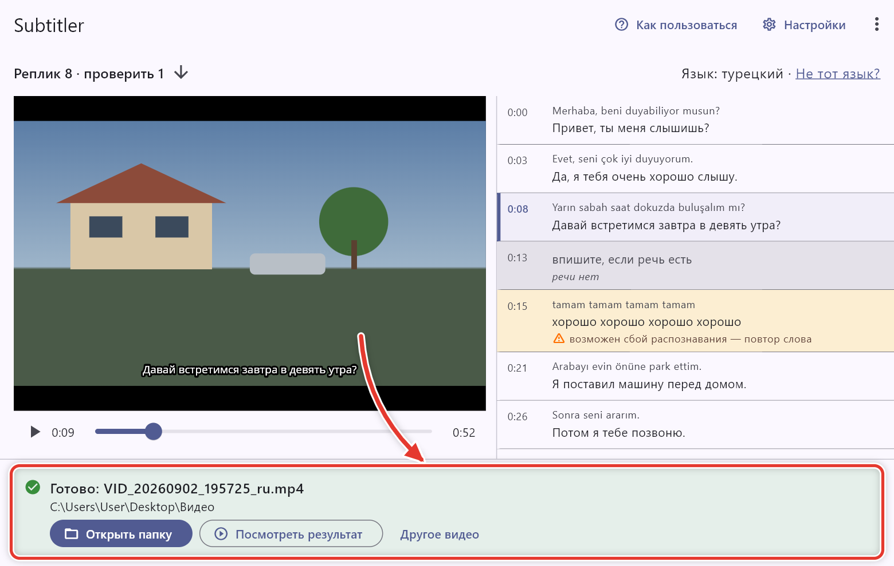

Нажмите «Сохранить видео с субтитрами» — это тоже займёт время. Готовое
видео `<имя>_ru.mp4` появится рядом с исходным: «Открыть папку» покажет его
в Проводнике, «Посмотреть результат» — воспроизведёт.

> После сохранения программа удаляет свои промежуточные файлы — субтитры
> .srt и файл с распознанным текстом. Если снова открыть то же видео, оно
> будет распознано заново, и это снова платно. На телефоне Android видео
> выбирается кнопкой «Выбрать видео», а готовое отдаётся кнопкой
> «Поделиться».

## Если что-то пошло не так

### Отправьте журнал разработчику

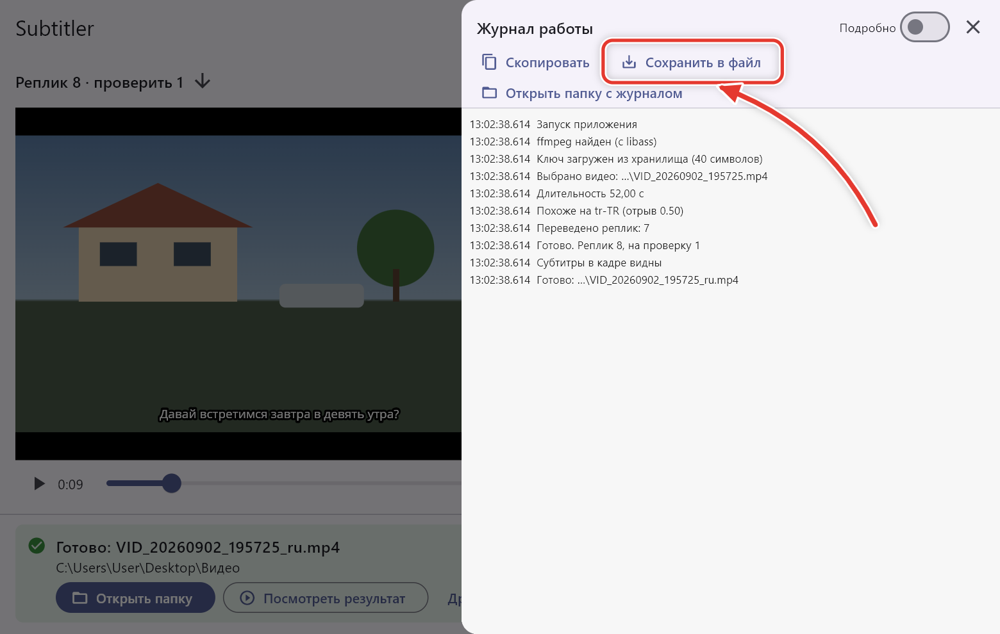

Программа сама пишет, что случилось и что делать. Если ошибка повторяется
или программа ведёт себя странно, откройте меню «⋮» → «Журнал работы»,
нажмите «Сохранить в файл» и отправьте файл разработчику.

> Ключа и текста реплик в журнале нет, названия папок с видео скрыты.
